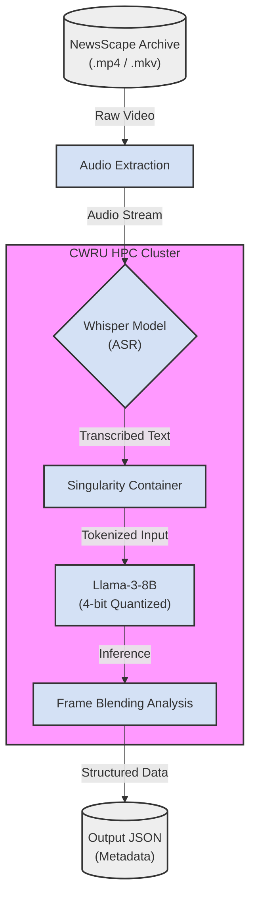

## 🛠️ Tech Stack
* **Containerization:** Apptainer / Singularity
* **Model:** Llama-3-8B (4-bit Quantized via `bitsandbytes`)
* **Orchestration:** Slurm Workload Manager
* **Language:** Python 3.9+
* **Optimization:** `bitsandbytes` (NF4 Quantization) to reduce VRAM usage by ~60%.  